> DB project - ECNU.SEI

- [DBproject](#DBproject)
- [项目背景](#项目背景)
- [目的](#目的)
- [功能](#功能)
- [技术栈](#技术栈)
- [技术框架](#技术框架)
- [数据库设计](#数据库设计)
- [ER图](#ER图)
- [关系模式](#关系模式)
- [项目运行](#项目运行)
- [后端操作](#后端操作)
- [前端操作](#前端操作)
- [项目预览](#项目预览)

# DBproject

## 项目背景

### 目的

作为⼀名软件⼯程专业的学⽣，找⼯作前的⼤量刷题是我们获得满意offer的必经之路。正所谓“⼯欲善其事，必先利其器”，我们需要⼀个系统对题⽬进⾏整理和汇总，从⽽帮助我们复习编程知识点，提⾼编码熟练度。

### 功能

本平台基于关系型数据库实现⼀个⾯试题⽬管理⽹站。

该⽹站中的试题主要包含：算法题和⽂字题，这些题⽬都包含了丰富的标签 Tag，提供对题⽬自由的增、删、改、查  CRUD 等功能。并且可以自定义丰富的文件夹、标签等，并根据它们对题目进行有针对性的筛选。同时该网站支持多客户端、支持用户间隔离、代码高亮、全文关键字匹配搜索、多媒体描述（图片音频），为用户提供更便捷高效的体验。

文档最后展示项目预览。

## 技术栈

### 技术框架
基于springboot+vue，实现前后端分离的模式。


|              | Version       | Version      |
| ------------ | ------------- | ------------ |
| SpringBoot   | 2.3.1.RELEASE | JDK1.8       |
| Mybatis      | 2.1.3         | MySQL 8.0.32 |
| Spring-Shiro | 1.5.2         | 2020.1       |

## 数据库设计

### ER图

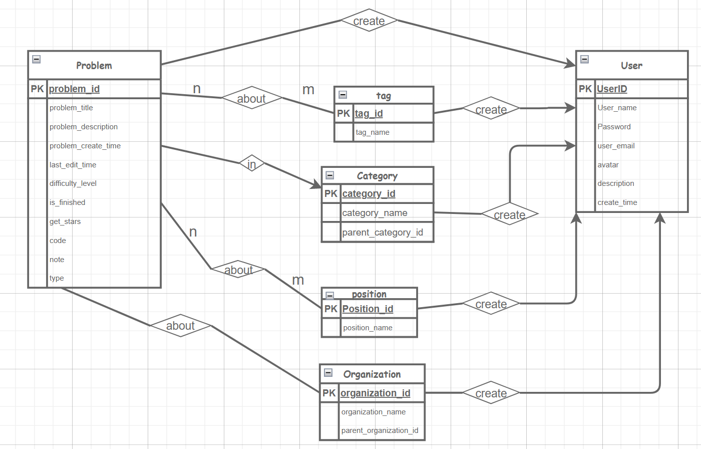

### 关系模式

```MySQL
`User` (user_id, username, password, avatar, email, des, create_time) 
用户表：包含属性：用户id，用户昵称，密码，头像，邮箱，个人描述，创建时间

`Problem` (id, title, description, content, code, type, create_time, last_edit_time, difficulty_level, is_finished, stars, user_id) 
-- 题目表：题目id，题目标题，题目解答（笔记），代码块，题目类型（1为文字题，2为算法题），创建时间，最近编辑时间，题目难度，完成情况（1已完成2未完成），掌握情况，创建该题的用户id）

`Organization`(id, name, pid, user_id) 
-- 公司-部门表：公司-部门id，公司-部门名称，父级公司-部门id，创建该公司-部门的用户id）
`Position`  (id, name, user_id) 
-- 岗位表：岗位id，岗位名称，创建该岗位的用户id）
`Tag` (id, name, user_id) 
-- 其他标签表：标签id，标签名称，创建标签的用户id）
`Category`(id, name, pid, user_id)
-- 文件夹表：文件夹id，文件夹名称，父文件夹id，创建该文件夹的用户id）

## 关系表：
`Problem_category` (id，problem_id, category_id)
`Problem_position` (id，problem_id,position_id)
`Problem_tag` (id，problem_id,tag_id)
`Problem_organization` (id，problem_id,organization_id) 
```


# 项目运行

## 后端操作

1. 在本地新建数据库，运行 `dbwebproj.sql`。
2. 将 `api` 文件夹用intellij打开，会自动识别为maven project，导入依赖即可；
    若没有自动识别，右键，点击 `add as maven project` 即可。
3. 修改配置文件：
    1. `application-dev.yml` 、`application-prod.yml` 修改 `username`、`password`、`url`
    2. `.properties` 配置文件
4. 运行即可。

## 前端操作

首先在terminal中进入到app文件夹。

```bash
cd app

# install dependency
npm install
# develop
npm run dev
```

若启动失败，尝试删除 `node_modules` 文件夹和 `package-lock.json`文件重新执行上述步骤。
如果仍然失败：尝试降低本地node.js版本，我是用的是 `v12.17.0`。

- 成功后将自动打开： http://localhost:9528 .

- Build

```bash
# build for test environment
npm run build:stage

# build for production environment
npm run build:prod
```


# 项目预览
- 首页

- 登录界面
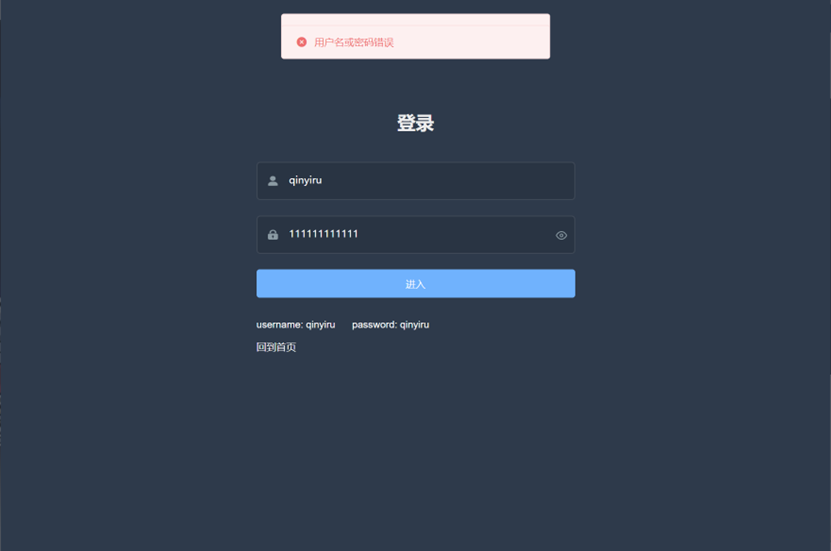
- 题目列表界面
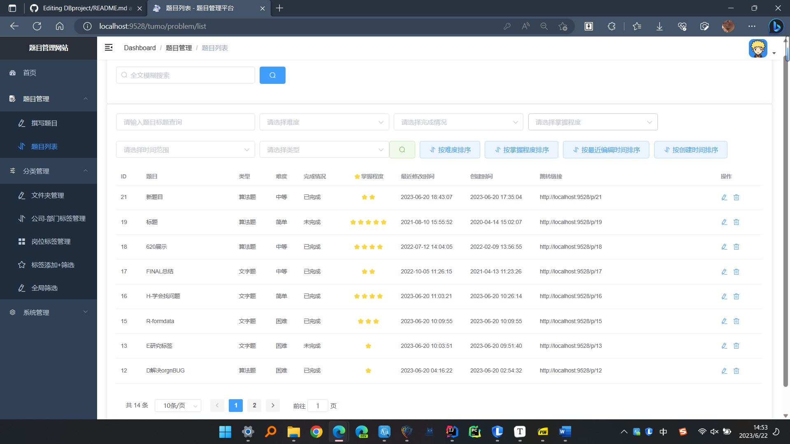
- 文字题edit界面

- 代码题edit界面

- 题目搜索界面
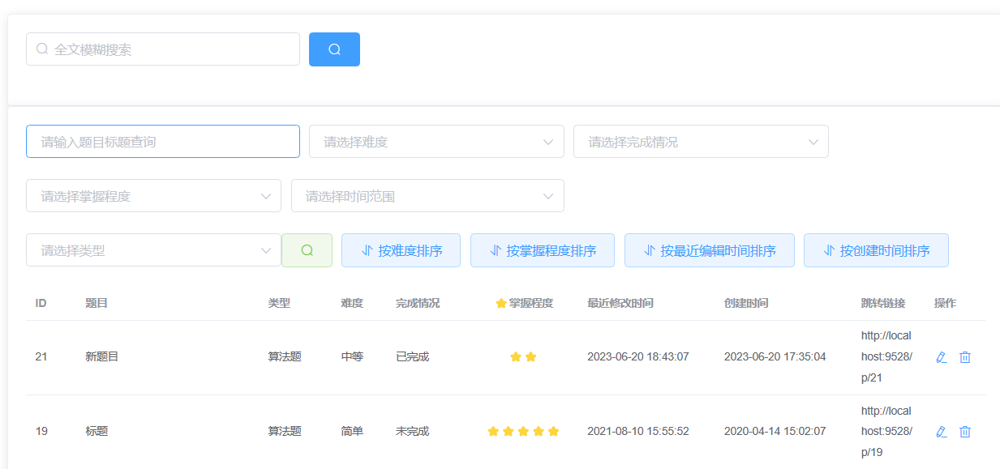
- 总查询界面-->多表动态联查
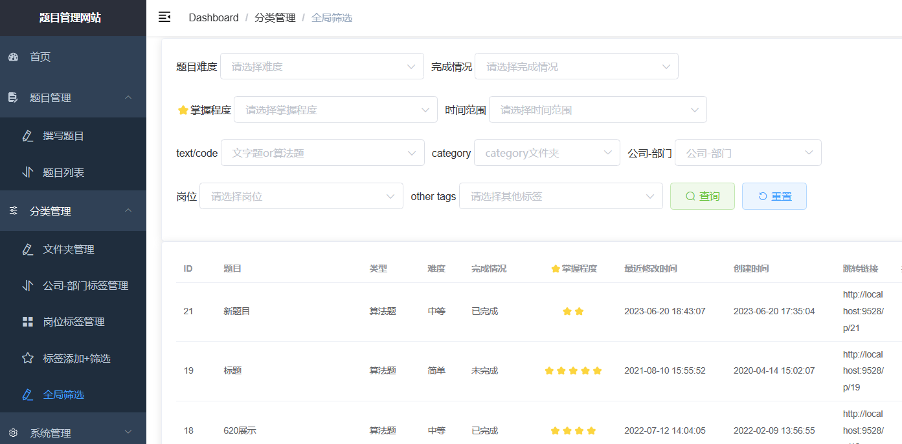
- 题目展示界面
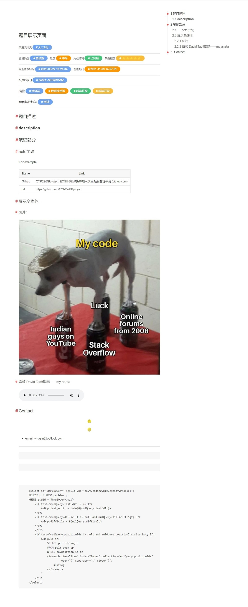
- category文件夹 + 左键搜索
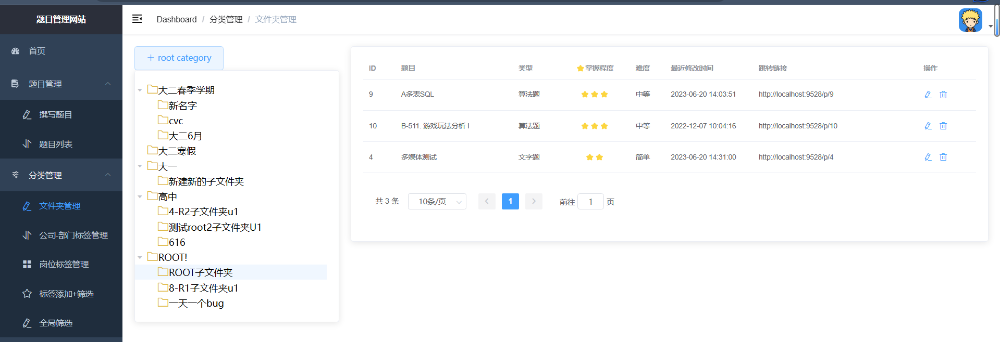
- category文件夹 + 右键操作
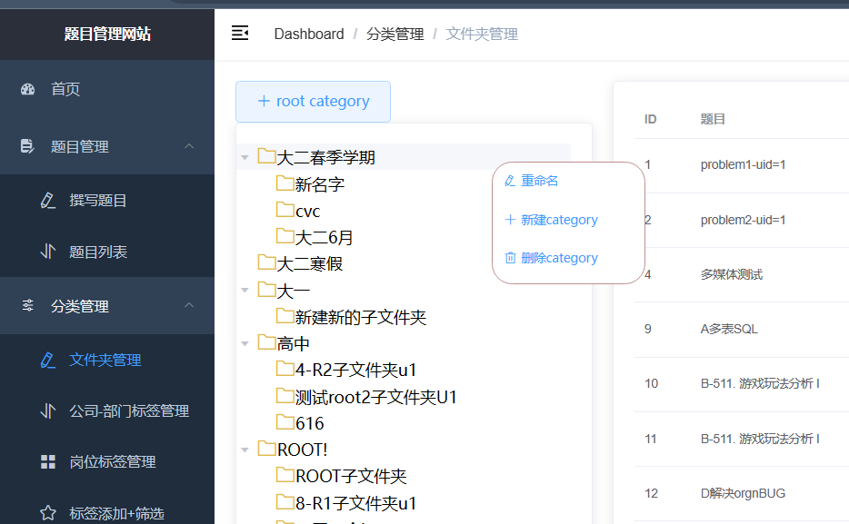
- category错误提醒 

//organization的实现和category基本一致，不再展示
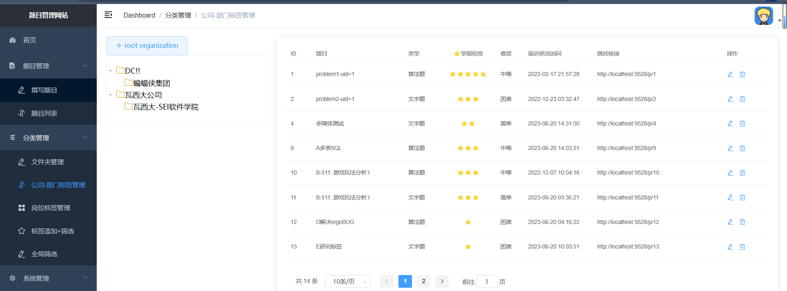

- position&tag删除前的检测
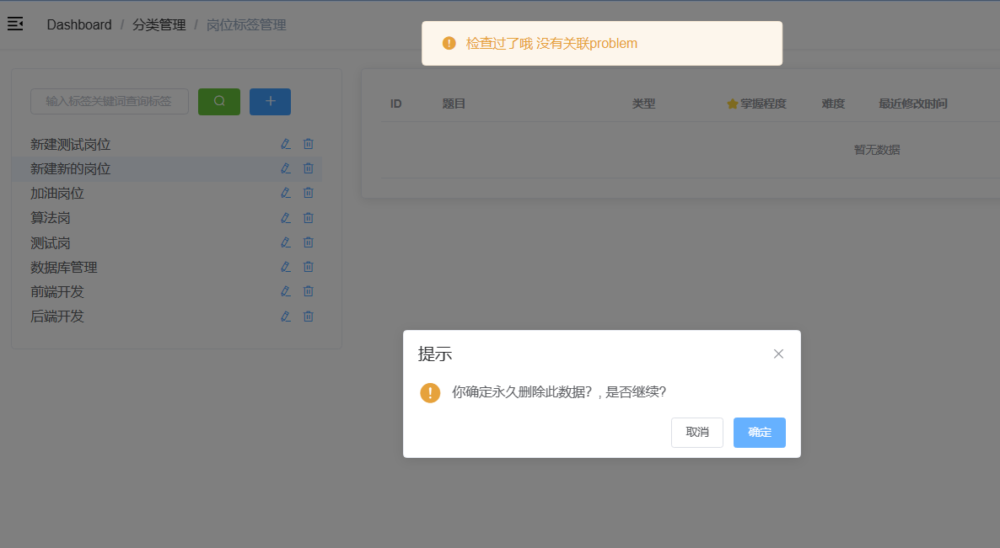
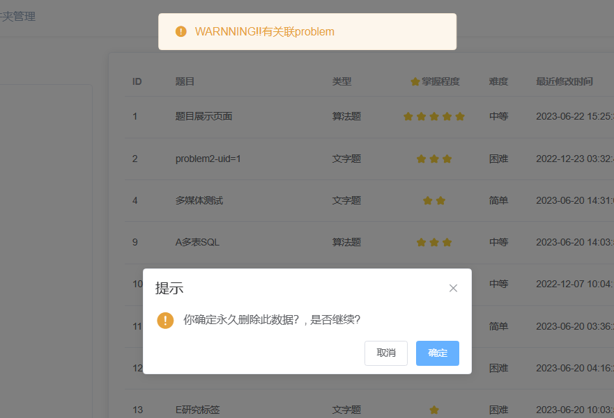
- position页面
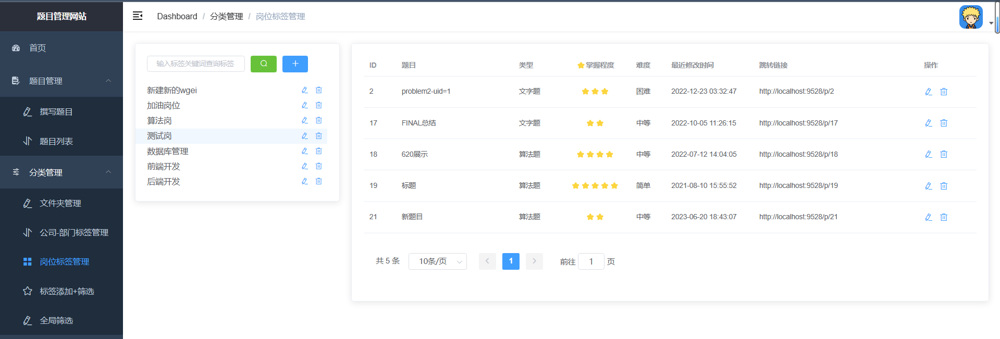

其他功能介绍
- 所有查询结果实现分页
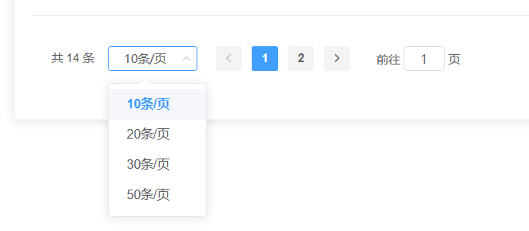
- 支持代码高亮
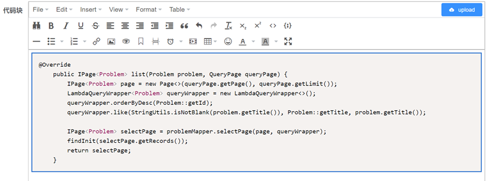
- 用户界面
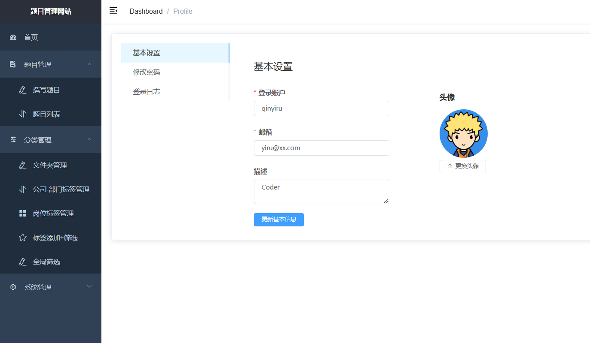
- 修改密码
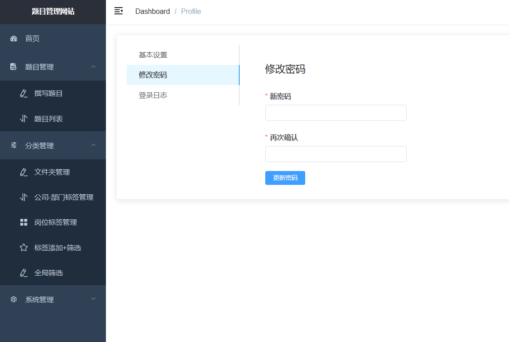
